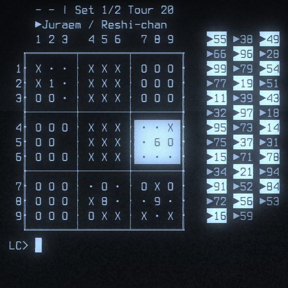

# mmmmmmmmm

Autrement appelé **mmm²** ou encore **9m**, est un jeu de morpion ultime.

Ecrit en **FR-ALGO**, il vous faudra pour y jouer :

* L'interpréteur adéquat qui se trouve ici : [https://github.com/teegre/fr-algo](https://github.com/teegre/fr-algo) (branche **dev** !),
* Ainsi que sa librairie standard : [https://github.com/teegre/fr-algo-std](https://github.com/teegre/fr-algo-std)

Si vous avez réussi à installer tout ça, bravo ! Il ne vous reste plus qu'à cloner ce dépot (vous savez comment faire), et de vous rendre dans le répértoire `mmmmmmmmm`.

Pour finir, entrez la commande suivante : `./mmm.algo`

## 1. Le plateau

- Le jeu se déroule sur une **grande grille 3×3**.

- Chaque case de cette grande grille contient une **petite grille 3×3** (soit 9 petites grilles au total).

- On joue donc simultanément dans les petites grilles et dans la grande.

## 2. Déroulement de la partie

1. **Début de match**
   
   - Le programme tire **à pile ou face** pour déterminer qui joue en premier.

2. **Un tour de jeu**
   
   - Le joueur place son jeton dans **une case d’une petite grille** en entrant une coordonnée sous la forme :
     
     - **LC**
       
       - **L** = numéro de la ligne (1 à 9).
       
       - **C** = numéro de la colonne (1 à 9).
     
     - Exemple :
       
       - `11` = ligne 1, colonne 1 (coin supérieur gauche du grand plateau).
       
       - `55` = ligne 5, colonne 5 (centre exact du grand plateau).
       
       - `99` = ligne 9, colonne 9 (coin inférieur droit du grand plateau).
   
   - Le coup joué dans une petite grille **détermine la petite grille** où l’adversaire devra jouer son prochain coup.
     
     - Exemple : si vous jouez dans la case **56** (ligne 5, colonne 6), l’adversaire devra jouer dans la **grille 6**.
   
   - Si la petite grille désignée est déjà gagnée ou remplie, l’adversaire peut jouer **dans n’importe quelle petite grille non encore gagnée**.

---

## 3. Gagner une petite grille

- Une petite grille se gagne comme un morpion classique : aligner **3 jetons identiques** (horizontal, vertical ou diagonal).

- Lorsqu’un joueur gagne une petite grille, la case correspondante de la grande grille est remplie avec son symbole.

- Une petite grille remplie sans vainqueur est bloquée (aucun joueur ne peut la gagner).

---

## 4. Gagner la grande grille

- L’objectif est de remporter la **grande grille 3×3** :
  
  - En alignant **3 petites grilles gagnées** (horizontal, vertical ou diagonal).

- Si toutes les petites grilles sont terminées sans qu’un joueur aligne trois petites grilles, le set est déclaré **nul**.

---

## 5. Système de match

- Un **match** se joue en **2 sets gagnants minimum**.

- Attribution des points :
  
  - Victoire d’un set = **1 point**.
  
  - Égalité dans un set = **1 point pour chaque joueur**.

- En cas d’égalité parfaite après 2 sets (ex. 2–2), on continue à jouer des sets supplémentaires jusqu’à ce qu’un vainqueur final soit désigné.

---

## 6. Victoire finale

- Le joueur qui atteint le premier le nombre requis de sets gagnants **et prend l’avantage** sur son adversaire remporte le match.

Je vous remercie de votre attention.
